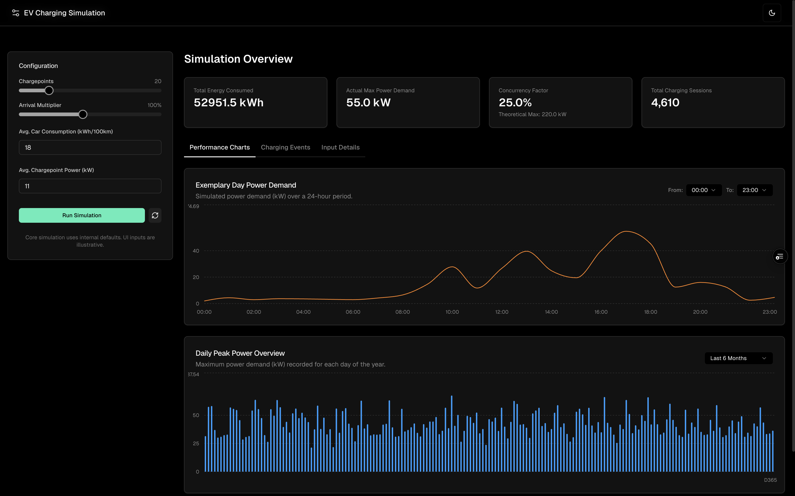
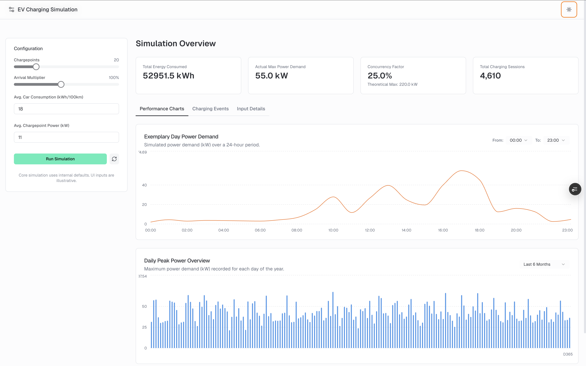

# EV Charging Station Simulation & Dashboard 🎨

## Project Overview

This project simulates the operation of an Electric Vehicle (EV) charging station and provides a web-based dashboard to visualize key performance indicators and energy consumption patterns. It's built with Next.js (App Router + RSC), TypeScript, and Tailwind CSS, Framer Motion, featuring a detailed simulation backend and an interactive frontend.

- Production - [https://ev.bel.baby](https://ev.bel.baby) for quick demo 🚀.

### Dark Mode ✨



### Light Mode ✨



## Core Functionalities 🧐

### 1. EV Charging Simulation (`lib/simulation/`) 📸

- **Object-Oriented Design**: The simulation is built using classes representing EVs, Chargepoints, Stations, and Statistics.
- **Configurable Parameters**:
  - Number of chargepoints.
  - EV arrival probabilities (configurable per hour).
  - EV charging demand distribution (distance driven since last charge).
  - Energy consumption per 100km.
  - Power per chargepoint.
- **Seeded Randomness**: Uses a seeded pseudo-random number generator for reproducible simulation runs.
- **Tick-Based System**: Simulates time in discrete intervals (ticks), typically 15 minutes.
- **Statistics Collection**: Tracks total energy consumed, actual maximum power demand, and concurrency factor.
- **Task 1 Validation**: Includes a specific script execution within `lib/simulation/index.ts` to validate against the parameters and expected outcomes of "Task 1" (as defined in the project's initial requirements).

### 2. Interactive Frontend Dashboard (`app/` & `components/`) 📸

- **Responsive Design**: Adapts to various screen sizes, inspired by Vercel's Observability UI.
- **Theme Toggle**: Supports light and dark modes.
- **Simulation Configuration Form**: Allows users to adjust key simulation parameters (number of chargepoints, arrival multiplier, etc.) and run new simulations.
- **Results Display**:
  - **Summary Statistics**: Key metrics like total energy consumed, max power demand, concurrency factor, and total charging sessions.
  - **Performance Charts**:
    - **Exemplary Day Power Demand**: Line chart showing simulated power demand (kW) over a 24-hour period. Includes hour-range filtering.
    - **Daily Peak Power Overview (Year)**: Bar chart showing maximum power demand (kW) recorded for each day of the year. Includes time-period filtering (1Y, 6M, 3M, 1M).
  - **Charging Events Breakdown**: Tabular display of (mocked) charging sessions per month and average daily/weekly sessions.
  - **Input Details**: Shows the parameters used for the current simulation run.
- **Smooth Tab Transitions**: Uses Framer Motion for animated transitions between tabs.
- **Toast Notifications**: Provides feedback for simulation status (success, failure, no changes) using Sonner.

## Tech Stack 🥅

- **Framework**: Next.js 15 (App Router)
- **Language**: TypeScript
- **Styling**: Tailwind CSS, shadcn/ui (for UI components)
- **Charting**: Recharts
- **Animation**: Framer Motion (for now only when switching between tabs)
- **Linting/Formatting**: ESLint, Prettier (assumed, standard for Next.js projects)

## Project Structure 💡

```
.
├── app/                      # Next.js App Router (frontend pages, layouts, server actions)
│   ├── actions.ts            # Server Action for running simulations
│   ├── globals.css           # Global styles
│   ├── layout.tsx            # Root layout
│   └── page.tsx              # Main dashboard page
├── components/               # React components
│   ├── layout/               # Layout components (e.g., header)
│   ├── simulation/           # Components related to simulation UI
│   │   ├── charts/           # Chart components
│   │   └── results/          # Components for displaying tabbed results
│   │   ├── common.tsx        # Common UI elements like StatCards
│   │   ├── simulation-form.tsx
│   │   └── simulation-results-display.tsx
│   ├── ui/                   # shadcn/ui components
│   ├── theme-provider.tsx
│   └── theme-toggle.tsx
├── lib/                      # Core logic and utilities
│   └── simulation/           # Simulation engine
│       ├── config.ts         # Simulation constants and probability distributions
│       ├── distributions.ts  # Weighted random choice logic
│       ├── ev.ts             # ElectricVehicle class
│       ├── chargepoint.ts    # Chargepoint class
│       ├── station.ts        # ChargingStation class
│       ├── random.ts         # Seeded random number generator
│       ├── statistics.ts     # SimulationStatistics class
│       └── index.ts          # Main EVChargingSimulation class & Task 1 validation
├── public/                   # Static assets
├── README.md                 # This file
├── next.config.mjs
├── package.json
├── tailwind.config.ts
└── tsconfig.json
```

## Setup and Installation 🧑‍💻

1.  **Clone the repository**:

    ```bash
    git clone git@github.com:bel7aG/ev-simulation.git
    cd ev-simulation
    ```

2.  **Install dependencies**:
    This project uses npm, yarn, or pnpm. Choose your preferred package manager.

    ```bash
    npm install
    # or
    yarn install
    # or
    pnpm install
    ```

3.  **(Optional) Initialize shadcn/ui components**:
    If the `components/ui` directory is not populated (e.g., if it's in `.gitignore`), you might need to add the components used by the project. The project currently uses:
    `button, card, dropdown-menu, input, label, select, slider, table, tabs, sonner (for toast), chart (for chart theming)`.
    You can add them via the shadcn/ui CLI:
    ```bash
    npx shadcn@latest add button card dropdown-menu input label select slider table tabs sonner chart
    ```
    Follow the prompts, ensuring you select the correct paths and configurations if asked. (Note: `shadcn-ui` was the older command, `shadcn@latest` is current).

## Running the Frontend Locally

1.  **Start the development server**:

    ```bash
    npm run dev
    # or
    yarn dev
    # or
    pnpm dev
    ```

2.  **Open your browser**:
    Navigate to [http://localhost:3000](http://localhost:3000) (or the port specified in your terminal).

You should see the EV Charging Simulation Dashboard. You can interact with the form to run simulations and view the results.

## Executing `simulation/index.ts` for Task 1 Validation

The `lib/simulation/index.ts` file contains a section at the bottom that automatically runs a validation simulation for "Task 1" parameters when the module is loaded on the server. In a Next.js development environment, this typically happens when the server starts or when the file is first imported by a server-side module (like `app/actions.ts`).

**To see the Task 1 validation output:**

1.  **Ensure your development server is running** (as described above).
2.  **Check your terminal/console where the Next.js development server is running.**

When the `EVChargingSimulation` class from `lib/simulation/index.ts` is imported by `app/actions.ts` (which happens when the frontend makes a request to the server action, or potentially on server start), the validation script `runAndLogTask1Validation()` within `lib/simulation/index.ts` will execute.

You should see output similar to this in your **server console**:

```
--- Running lib/simulation/index.ts Task 1 Validation ---
[VALIDATION] Simulating Task 1: 20 CPs, Seed: 12345, Full Year.
  Simulating... Tick 109500/350400 (Day 115) for 20 CPs
  Simulating... Tick 112320/350400 (Day 118) for 20 CPs
  ... (more simulation progress logs if not verbose) ...
[VALIDATION] Task 1 Results from lib/simulation/index.ts:
  Total Energy Consumed: XXX.XX kWh
  Theoretical Max Power Demand: 220.00 kW
  Actual Max Power Demand: XXX.XX kW
  Concurrency Factor: XX.XX%
[VALIDATION] Hint Checks for Task 1 (Note: Hints were based on the *original* T1/T2 dataset):
  Actual Max Power (XXX.XX kW) vs. original hint range [77-121 kW]: ...
  Concurrency Factor (XX.XX%) vs. original hint range [35-55%]: ...
[VALIDATION] The simulation is now using the NEW T1/T2 dataset. Results will differ from original expectations.
--- End of lib/simulation/index.ts Task 1 Validation ---
```

**Note**:

- The exact values (XXX.XX) will depend on the simulation logic and the current dataset in `lib/simulation/config.ts`.
- The validation script runs with `verbose: false` for the simulation itself to keep the console output focused on the summary statistics relevant to Task 1. However, the main simulation loop in `index.ts` has progress logs that might appear.
- If you don't see this output immediately, try triggering the "Run Simulation" button on the frontend once, as this will ensure the server action (and thus the `lib/simulation/index.ts` module) is loaded.

This README should provide a good overview for anyone looking to understand, set up, and run your project.
